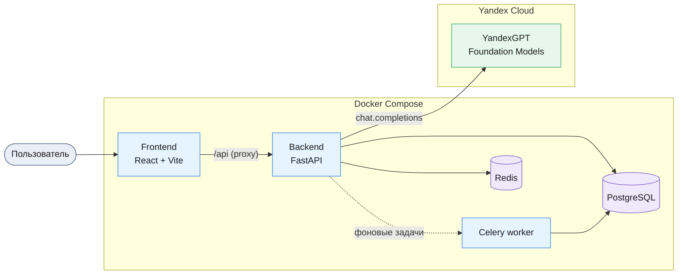
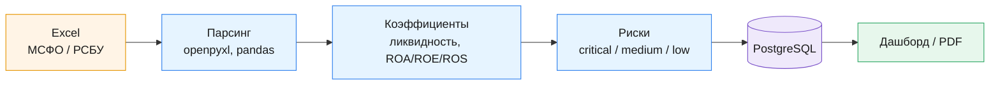
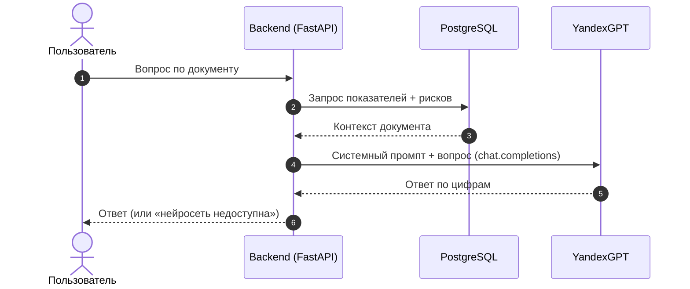

# Нейроаудитор

**Платформа аудита финансовой отчётности с AI-ассистентом:** загрузка Excel-отчётов (*МСФО/РСБУ*), автоматический расчёт коэффициентов и выявление рисков, дашборд и PDF, а также чат-бот по документу на базе *YandexGPT* (`Yandex Cloud Foundation Models`).

## Содержание

### 1. Введение
*   **Назначение**: ускорить аудит и финансовый анализ — платформа сама считает показатели, находит риски и объясняет их на естественном языке вместо ручной работы в таблицах.
*   **Для кого**: аудиторы, финансовые аналитики, бухгалтеры (роли Админ / Аудитор / Просмотр).
*   **Стек (frontend)**: `React 18`, `TypeScript`, `Vite`, `Material-UI`, `Zustand`, `Recharts`.
*   **Стек (backend)**: `FastAPI` (Python 3.10+), `PostgreSQL`, `Redis`, `SQLAlchemy 2.0` + `Alembic`, `Celery`, `Pandas` / `OpenPyXL`.
*   **AI**: `YandexGPT` через OpenAI-совместимый API.

### 2. Архитектура решения

**Компоненты и сервисы**



**Поток анализа документа**



**Поток AI-чата**



**Сервисы Yandex Cloud** — `Foundation Models` (YandexGPT) через OpenAI-совместимый эндпоинт `https://llm.api.cloud.yandex.net/v1`; сервисный аккаунт с ролью `ai.languageModels.user`.

### 3. Подготовка окружения
*   Переменные окружения:
    ```bash
    cp .env.example .env
    cp backend/.env.example backend/.env
    cp frontend/.env.example frontend/.env
    ```
*   Ключи YandexGPT (в `backend/.env`):
    1.  Активируйте платёжный аккаунт в Yandex Cloud (*Foundation Models требуют биллинг*).
    2.  Создайте сервисный аккаунт с ролью `ai.languageModels.user`.
    3.  Выпустите для него **API-ключ** (именно API-ключ, не «статический ключ доступа») → `AI_YC_API_KEY`.
    4.  `AI_YC_FOLDER_ID` — каталог, **в котором создан этот сервисный аккаунт** (иначе Yandex вернёт 403 «folder does not match service account folder»).
    ```env
    AI_PROVIDER=yandex
    AI_BASE_URL=https://llm.api.cloud.yandex.net/v1
    AI_YC_API_KEY=<API-ключ сервисного аккаунта>
    AI_YC_FOLDER_ID=<ID каталога>
    AI_MODEL=yandexgpt-lite/latest      # или yandexgpt/latest (Pro)
    ```
*   Запуск через Docker (рекомендуется): `docker compose up --build` → Frontend `http://localhost:5173`, Swagger UI `http://localhost:8000/docs`.
*   Локальный запуск (backend): `python -m venv .venv` → активация (`source .venv/bin/activate` / `.\.venv\Scripts\Activate.ps1`) → `pip install -r requirements.txt -r requirements-dev.txt` → `uvicorn app.main:app --reload` (схема БД накатывается автоматически при старте).
*   Локальный запуск (frontend): `npm install` → `npm run dev`.

### 4. Логика приложения
*   **Загрузка и анализ**: Excel (МСФО/РСБУ) → баланс, ОПУ, ОДДС; коэффициенты — ликвидность, рентабельность (ROA / ROE / ROS), оборачиваемость, устойчивость.
*   **Выявление рисков**: критические / средние / низкие с рекомендациями; визуализация (графики) и генерация PDF-отчёта.
*   **AI-чат по документу**: отвечает по фактическим цифрам документа; контекст (показатели + риски) передаётся в системный промпт, вызов — `chat.completions` (OpenAI SDK + заголовок `x-folder-id`). История сессий сохраняется.
*   **Выбор провайдера** (`AI_PROVIDER`): `auto` — YandexGPT, если задан, иначе OpenAI, иначе сообщение «нейросеть недоступна»; `yandex` — только YandexGPT; `openai` — только OpenAI.
*   **Нет соединения с моделью** → бот отвечает коротким сообщением о недоступности (офлайн-режима / ответов «на регулярках» нет).

### 5. Тестирование
*   Автотесты: `cd backend && pytest`.
*   Пример отчёта: `example/sample_report_large.xlsx` (развёрнутый РСБУ на 3 года, 2023–2025). Загрузите его в разделе «Загрузка», дождитесь анализа и задавайте вопросы в чате. Показатели за 2025: выручка 320 млн, чистая прибыль 12 млн, текущая ликвидность 1.25, быстрая 0.69, ROA 4.8% / ROE 10% / ROS 7.8%, долг/капитал 1.08; выявляются 3 средних риска.
*   Примеры вопросов и ожидаемых ответов (по смыслу; формулировки у нейросети варьируются):

    | Вопрос | Ожидаемый ответ |
    |--------|-----------------|
    | «Оцени ликвидность компании» | Текущая 1.25 и быстрая 0.69 ниже норм (≥1.5 / ≥1.0) → риск сниженной ликвидности + рекомендации. |
    | «Какая рентабельность?» | ROA 4.8%, ROE 10%, ROS 7.8%; прибыль положительная, оценка эффективности активов. |
    | «Какие риски и что делать?» | 3 средних риска: сниженная ликвидность, низкая быстрая ликвидность, повышенная долговая нагрузка + рекомендации. |
    | «Стоит ли беспокоиться о долге?» | Долг/капитал 1.08 выше норматива 1.0 — умеренно повышенная нагрузка; советы по снижению. |
    | Вопрос не по теме («какая погода?») | Вежливо возвращает к финансовым данным документа. |

*   Проверка вызова модели: `docker compose logs -f backend | grep -i yandex` (`Запрос к YandexGPT (gpt://...)` — реальный вызов; `YandexGPT недоступен...` — откат к сообщению о недоступности).

### 6. Результаты и выводы
*   Готовое end-to-end решение: от загрузки Excel-отчёта до расчёта показателей, выявления рисков и объяснения их на естественном языке.
*   Экономия времени аудитора и снижение числа ручных ошибок; результат — предсказуемый и воспроизводимый.
*   Полностью на российском стеке (Yandex Cloud), что закрывает вопросы импортозамещения и хранения данных.

## Best Practices

*   **Выбор модели**: `yandexgpt-lite/latest` — для быстрых и менее затратных ответов, `yandexgpt/latest` (Pro) — для более глубокого анализа.
*   **Безопасность ключей**: храните ключи в `backend/.env` (файл в `.gitignore`), не в коде и не в корневом `.env`; в Docker-образ они не попадают (`.dockerignore`).
*   **Совпадение каталога**: `AI_YC_FOLDER_ID` должен совпадать с каталогом сервисного аккаунта, иначе Yandex вернёт 403.
*   **Биллинг**: Foundation Models работают только при активном платёжном аккаунте Yandex Cloud.
*   **Структурированный контекст**: показатели и риски документа передаются в системный промпт — модель отвечает по фактическим цифрам, а не «в общем».
*   **Продакшн**: для боевого фронтенда используйте сборку (`npm run build`) и отдачу статики (не `vite dev`); задайте `APP_ENV=production` (обязателен сильный `SECRET_KEY`), `APP_DEBUG=false` и реальный `CORS_ORIGINS`.

## Дополнительные ресурсы

*   **AI Studio YandexGPT**: [Обзор и документация](https://yandex.cloud/ru/docs/ai-studio/quickstart/yandexgpt)
*   **OpenAI-совместимое API**: [Документация по использованию SDK](https://yandex.cloud/ru/docs/foundation-models/concepts/openai-compatibility)
*   **API-ключ сервисного аккаунта**: [Управление API-ключами](https://yandex.cloud/ru/docs/iam/operations/authentication/manage-api-keys)
*   **FastAPI**: [Документация](https://fastapi.tiangolo.com), **Vite**: [Документация](https://vitejs.dev)

---

**Версия:** 1.0  
**Последнее обновление:** Февраль 2026  
**Язык:** Python 3.10+ / TypeScript  
**Лицензия:** MIT
