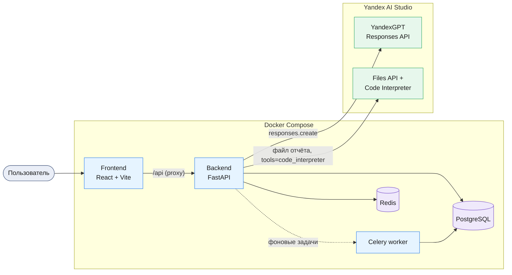
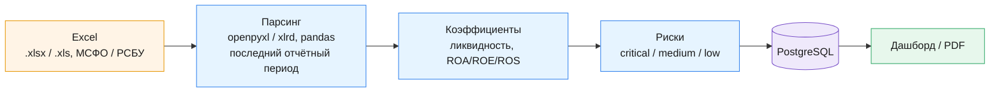
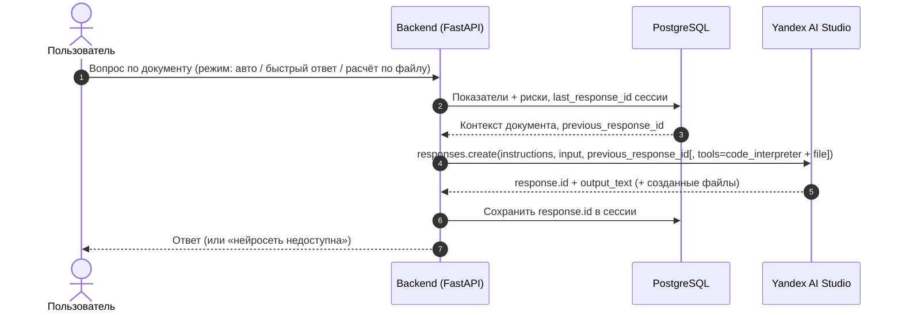

# Нейроаудитор

**Платформа для аудита финансовой отчётности с AI-ассистентом:** загрузка Excel-отчётов (*МСФО/РСБУ*), автоматический расчёт коэффициентов и выявление рисков, построение дашбордов и формирование PDF, а также чат-бот по документам на базе *YandexGPT* (`Yandex AI Studio`, Responses API) с режимом Code Interpreter для анализа файла на стороне AI Studio.

## Содержание

### 1. Введение
*   **Назначение**: ускорить аудит и финансовый анализ — платформа сама считает показатели, находит риски и объясняет их на естественном языке вместо ручной работы в таблицах.
*   **Для кого**: аудиторы, финансовые аналитики.
*   **Стек (frontend)**: `React 18`, `TypeScript`, `Vite`, `Material-UI`, `Zustand`, `Recharts`.
*   **Стек (backend)**: `FastAPI` (Python 3.10+), `PostgreSQL`, `Redis`, `SQLAlchemy 2.0` + `Alembic`, `Celery`, `Pandas` / `OpenPyXL` / `xlrd`, `ReportLab` (шрифты DejaVu для кириллицы).
*   **AI**: `YandexGPT` через **Responses API Yandex AI Studio** (OpenAI SDK как клиент); контекст диалога — `previous_response_id`; режим «Расчёт по файлу» — **Code Interpreter** (Files API + инструмент `code_interpreter`), в режиме «Авто» включается только когда вопрос требует самого файла.

### 2. Архитектура решения

**Компоненты и сервисы**



**Поток анализа документа**



**Поток AI-чата**



**Сервисы Yandex AI Studio** — YandexGPT через OpenAI-совместимый эндпоинт `https://ai.api.cloud.yandex.net/v1` (каталог передаётся как `project`, без спец-заголовков), Responses API для диалога, Files API + Code Interpreter для анализа файла. Сервисный аккаунт с ролями `ai.languageModels.user` (модели) и `ai.assistants.editor` (Files API / Code Interpreter).

### 3. Подготовка окружения
*   Переменные окружения:
    ```bash
    cp .env.example .env
    cp backend/.env.example backend/.env
    cp frontend/.env.example frontend/.env
    ```
*   Ключи Yandex AI Studio (в `backend/.env`):
    1.  Активируйте платёжный аккаунт в Yandex Cloud (*AI Studio требует биллинг*).
    2.  Создайте сервисный аккаунт с ролью `ai.languageModels.user`; для режима Code Interpreter добавьте `ai.assistants.editor` (без неё Files API отвечает `403 Permission CREATE denied`).
    3.  Выпустите для него **API-ключ** (именно API-ключ, не «статический ключ доступа») → `AI_YC_API_KEY`. У ключа может быть срок действия: при `401 … apikey has expired` выпустите новый.
    4.  `AI_YC_FOLDER_ID` — каталог, **в котором создан этот сервисный аккаунт** (иначе Yandex вернёт 403 «folder does not match service account folder»).
    ```env
    AI_BASE_URL=https://ai.api.cloud.yandex.net/v1
    AI_YC_API_KEY=<API-ключ сервисного аккаунта>
    AI_YC_FOLDER_ID=<ID каталога>
    AI_MODEL=yandexgpt-lite/latest        # или yandexgpt/latest (Pro)
    # режим Code Interpreter (Files API + Responses API tool)
    AI_CODE_INTERPRETER_ENABLED=true
    AI_CI_MODEL=qwen3-235b-a22b-fp8/latest # YandexGPT Lite принимает tools, но код не выполняет — для Code Interpreter нужен Qwen
    AI_CI_FILE_PURPOSE=user_data
    ```
*   Запуск через Docker (рекомендуется): `docker compose up --build` → Frontend `http://localhost:5173`, Swagger UI `http://localhost:8000/docs`. Миграции Alembic накатываются автоматически при старте backend.
*   Локальный запуск (backend): `python -m venv .venv` → активация (`source .venv/bin/activate` / `.\.venv\Scripts\Activate.ps1`) → `pip install -r requirements.txt -r requirements-dev.txt` → `uvicorn app.main:app --reload`.
*   Локальный запуск (frontend): `npm install` → `npm run dev`.

### 4. Логика приложения
*   **Загрузка и анализ**: Excel `.xlsx` (openpyxl) и `.xls` (xlrd), МСФО/РСБУ → баланс, ОПУ, ОДДС; коэффициенты — ликвидность, рентабельность (ROA / ROE / ROS), оборачиваемость, устойчивость. Анализируется **последний отчётный период**: парсер находит в шапке листа колонку с самой поздней датой/годом (без дат — последний столбец); многолетние файлы принимаются, период попадает в сводку («Отчётный период: …»). Строки отчёта сопоставляются по границам слов с исключениями (например, «Оборотные активы» не путаются с «Внеоборотными»), баланс сверяется (`оборотные + внеоборотные = итого`).
*   **Выявление рисков**: критические / средние / низкие с рекомендациями; визуализация (графики) и генерация PDF-отчёта с русскими подписями показателей.
*   **AI-чат, «Быстрый ответ»** (режим `context`): показатели и риски документа передаются в системный промпт (`instructions`), вопрос — в `input`, вызов `responses.create`. **История диалога передаётся модели**: `response.id` сохраняется в сессии и отправляется как `previous_response_id` на следующем ходе (контекст хранится на стороне AI Studio); при смене документа цепочка начинается заново, протухший id перезапускает цепочку автоматически.
*   **AI-чат, «Расчёт по файлу»** (режим `code_interpreter`; доступен при выбранном документе, если включён `AI_CODE_INTERPRETER_ENABLED`): файл отчёта один раз загружается в Files API, затем модель анализирует его в контейнере инструментом `code_interpreter` (pandas/openpyxl на стороне Yandex) — можно попросить пересчитать коэффициенты, построить таблицу или график; созданные файлы скачиваются кнопками под ответом (`GET /api/chat/artifacts/{fileId}`, файл отдаётся только владельцу сессии). Ответ занимает 1–3 минуты (модель несколько раз выполняет код), таймаут — `AI_CI_TIMEOUT_SECONDS` (по умолчанию 300 с). Доступность режима фронт узнаёт через `GET /api/chat/capabilities`.
*   **AI-чат, «Авто»** (режим `auto`, по умолчанию): быстрый ответ, но если в вопросе просят файл, таблицу, график, выгрузку или пересчёт «по файлу», запрос уходит в Code Interpreter. Выбор делается простой эвристикой по тексту вопроса (`backend/app/ai/mode_router.py`), без дополнительного вызова модели; фактический режим возвращается в поле `mode` ответа и подписывается под сообщением в чате.
*   **Нет соединения с моделью** → бот отвечает коротким сообщением о недоступности (офлайн-режима нет).

### 5. Тестирование
*   Автотесты: `cd backend && pytest` (в Docker: `docker compose exec backend pytest`) — парсер (регрессия коллизии ключей, выбор периода, `.xls`), клиент AI Studio (`previous_response_id`, retry, Code Interpreter), чат, PDF (кириллица), финансовые расчёты.
*   Пример отчёта: `example/sample_report_large.xlsx` (копия — `backend/tests/fixtures/sample_report_large.xlsx`), развёрнутый РСБУ на 3 года (2023–2025). Загрузите его в разделе «Загрузка», дождитесь анализа и задавайте вопросы в чате. Показатели за 2025: выручка 320 млн, чистая прибыль 12 млн, текущая ликвидность 1.25, быстрая 0.69, ROA 4.8% / ROE 10% / ROS 7.8%, долг/капитал 1.08; выявляются 3 средних риска.
*   Примеры вопросов и ожидаемых ответов (по смыслу; формулировки у нейросети варьируются):

    | Вопрос | Ожидаемый ответ |
    |--------|-----------------|
    | «Оцени ликвидность компании» | Текущая 1.25 и быстрая 0.69 ниже норм (≥1.5 / ≥1.0) → риск сниженной ликвидности + рекомендации. |
    | «Какая рентабельность?» | ROA 4.8%, ROE 10%, ROS 7.8%; прибыль положительная, оценка эффективности активов. |
    | «Какие риски и что делать?» | 3 средних риска: сниженная ликвидность, низкая быстрая ликвидность, повышенная долговая нагрузка + рекомендации. |
    | «А что с долгом?» (вторая реплика) | Понимает вопрос в контексте предыдущего: долг/капитал 1.08 выше норматива 1.0 — умеренно повышенная нагрузка. |
    | Режим Code Interpreter: «Посчитай коэффициент текущей ликвидности по файлу» | Модель читает файл в контейнере и возвращает расчёт по данным отчёта. |
    | Вопрос не по теме («какая погода?») | Вежливо возвращает к финансовым данным документа. |

*   Проверка вызова модели: `docker compose logs -f backend | grep -i yandex` — строка `Запрос к YandexGPT (gpt://...), контекст: True/False` означает реальный вызов (с/без `previous_response_id`); `YandexGPT недоступен: ...` — откат к сообщению о недоступности.

### 6. Результаты и выводы
*   Готовое end-to-end решение: от загрузки Excel-отчёта до расчёта показателей, выявления рисков и объяснения их на естественном языке — с многоходовым диалогом по документу.
*   Экономия времени аудитора и снижение числа ручных ошибок; результат детерминированный и воспроизводимый (локальный расчёт), а глубокий анализ файла — силами Code Interpreter в AI Studio.
*   Полностью на инструментах Yandex AI Studio (YandexGPT, Responses API, Files API, Code Interpreter), что закрывает вопросы импортозамещения и хранения данных.

## Best Practices

*   **Выбор модели**: `yandexgpt-lite/latest` — для быстрых и менее затратных ответов, `yandexgpt/latest` (Pro) — для более глубокого анализа; для Code Interpreter используйте модель с большим контекстом (`AI_CI_MODEL`, в примерах Yandex — Qwen).
*   **Контекст диалога**: не пересылайте историю сообщений — сохраняйте `response.id` и передавайте `previous_response_id`; ответы хранятся на стороне AI Studio ограниченное время, поэтому обрабатывайте отклонённый id перезапуском цепочки.
*   **Файлы для Code Interpreter**: загружайте документ в Files API один раз и переиспользуйте `file_id`; файлы в контейнере доступны модели на протяжении его жизни. Передавайте в Files API оригинальное имя файла — под ним модель ищет его в контейнере. Для инструмента используйте Qwen (`AI_CI_MODEL`): YandexGPT Lite принимает параметр `tools`, но код не выполняет. Созданные моделью файлы приходят как аннотации `container_file_citation` (`file_id`, `filename`) только когда модель даёт на них ссылку — попросите об этом в промпте. Ссылка из текста ответа без авторизации не открывается (403); скачивать файл нужно через Files API — `client.files.content(file_id)`. Идентификатор файла у Yandex не привязан к пользователю, поэтому приложение хранит, в какой сессии файл создан (таблица `chat_artifacts`), и отдаёт его через свой эндпоинт только владельцу сессии.
*   **Безопасность ключей**: храните ключи в `backend/.env` (файл в `.gitignore`), не в коде и не в корневом `.env`; в Docker-образ они не попадают (`.dockerignore`).
*   **Совпадение каталога**: `AI_YC_FOLDER_ID` должен совпадать с каталогом сервисного аккаунта, иначе Yandex вернёт 403.
*   **Биллинг**: AI Studio работает только при активном платёжном аккаунте Yandex Cloud.
*   **Структурированный контекст**: показатели и риски документа передаются в системный промпт — модель отвечает по фактическим цифрам, а не «в общем».
*   **Продакшн**: для боевого фронтенда используйте сборку (`npm run build`) и отдачу статики (не `vite dev`); задайте `APP_ENV=production` (обязателен сильный `SECRET_KEY`), `APP_DEBUG=false` и реальный `CORS_ORIGINS`.

## Дополнительные ресурсы

*   **Yandex AI Studio, YandexGPT**: [Быстрый старт](https://aistudio.yandex.ru/docs/ru/ai-studio/quickstart/)
*   **OpenAI-совместимое API AI Studio**: [Особенности реализации](https://aistudio.yandex.ru/docs/ru/ai-studio/concepts/openai-compatibility)
*   **Responses API и контекст диалога**: [Переход с AI Assistant API на Responses API](https://aistudio.yandex.ru/docs/ru/ai-studio/concepts/agents/assistant-responses-migration)
*   **Code Interpreter**: [Концепция](https://aistudio.yandex.ru/docs/ru/ai-studio/concepts/agents/tools/code-interpreter) · [Как использовать](https://aistudio.yandex.ru/docs/ru/ai-studio/operations/agents/use-code-interpreter)
*   **API-ключ сервисного аккаунта**: [Управление API-ключами](https://yandex.cloud/ru/docs/iam/operations/authentication/manage-api-keys)
*   **Примеры кода**: [yandex-ai-studio-api-examples](https://github.com/yandex-ai-studio/yandex-ai-studio-api-examples)
*   **FastAPI**: [Документация](https://fastapi.tiangolo.com), **Vite**: [Документация](https://vitejs.dev)

---

**Версия:** 1.1  
**Последнее обновление:** Сентябрь 2026  
**Язык:** Python 3.10+ / TypeScript  
**Лицензия:** MIT — см. [LICENSE](LICENSE)
